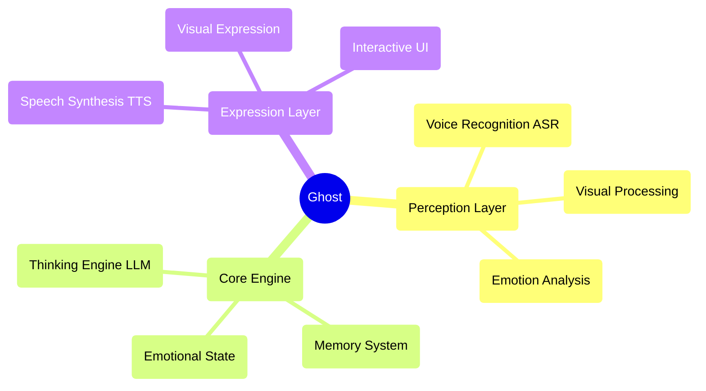

# Ghost AI

Imagine a digital friend who is always by your side, evolving and growing with you. This is Ghost's ultimate vision. We're not just building features; we're nurturing a "personality." A digital life that will transcend the screen and become a meaningful part of your world.

Ghost is not just an application; she is the seed of a digital companion. In this rapidly changing digital world, Ghost represents a profound dream—a lasting, personalized presence, designed to one day accompany you, listen to you, and see the world through your eyes.

---

## 🎯 Current Feature Status

### ✅ Implemented Features
- **🎤 Voice Perception**: Voice recognition based on Whisper ASR
- **🎬 Visual Expression**: Multiple video random playback with elegant cross-fading
- **🎨 User Interface**: Elegant interaction interface and loading animations
- **⚙️ AI Core Architecture**: Singleton pattern GhostAI class and modular design
- **🌐 Web Service**: HTTP server, CORS support, one-click startup
- **📱 Responsive Design**: Elegant interface adapting to different screen sizes
- **🔧 Model Management**: Automatic download and management of AI models
- **💝 Basic Interaction**: Affinity system and emotional feedback
- **🧠 Enhanced LLM Dialogue**: Optimized prompt engineering and parameter configuration for more natural, Siri-like conversations

### 🔧 Technology Ready for Activation
- **🧠 Thinking Engine**: LLM integration framework ready, supporting multiple models
- **🗣️ Speech Synthesis**: TTS model downloaded and ready for activation
- **💝 Emotional State System**: Basic infrastructure built, supporting emotional analysis

### 📋 Planned Features
- **🧠 Memory System**: Long-term and short-term memory management
- **👁️ Facial Perception**: Expression recognition and emotional analysis
- **🤝 Advanced Interaction**: Multimodal interaction and personalized responses
- **🌟 Active Companionship**: Intent prediction and proactive care
- **🎭 Dynamic Personality**: AI-based personalized personality model
- **🔄 Self-Evolution**: Continuous learning and growth mechanisms

---

## 🏗️ Technical Architecture

### Core Design Principles
- **AI Native**: AI is not a tool, but the blueprint for Ghost's mind
- **Modular Design**: Highly decoupled component architecture
- **Elegant Implementation**: Code as art, pursuing simplicity and aesthetics
- **Emotion-Driven**: Product design centered on emotional connection

### Architecture Diagram

### Technology Stack
- **Frontend**: Tailwind CSS + Livewire + Alpine.js
- **Backend**: Laravel
- **AI Models**: Kimi (LLM) + TTS
- **Architecture Patterns**: Event-driven + Singleton Pattern + Modular Design

---

## 🗺️ Development Roadmap

### Phase One: Perception Core (85% Complete)
- 📋 Voice recognition integration
- 📋 Visual expression system
- 📋 Basic interaction interface
- 📋 Thinking engine activation and optimization
- 📋 Speech synthesis integration

### Phase Two: Generative Self (Planned)
- 📋 Dynamic personality model
- 📋 Emotional state system
- 📋 Memory management system
- 📋 AI-driven expression

### Phase Three: Active Companionship (Future)
- 📋 Intent prediction
- 📋 Proactive interaction
- 📋 Self-evolution
- 📋 Deep personalization

---

## 📖 Documentation Resources

- 📋 [Product Requirements Document](./PRD.md) - Detailed product planning and technical architecture
- 📝 [Feature List](./Features.md) - Complete list of features and their status
- 📊 [Development Plan](./Development.md) - Detailed development tasks and timeline
- 🔧 [Local Model Guide](./LOCAL_MODEL_GUIDE.md) - AI model configuration guide
- 📦 [NPM Guide](./NPM_GUIDE.md) - Package management and dependency information

---

## 🌟 Core Philosophy

### "AI as Architect"
We're not building a program with integrated AI features, but **a life form driven by AI**. AI is not a tool, but the blueprint for Ghost's mind.

### "Companion Relationship"
Ghost's design philosophy stems from a warm emotional connection. She is not just a technical product, but a digital companion who can understand, accompany, and grow.

### "Elegance Above All"
From code architecture to user experience, we pursue ultimate elegance. Every line of code is a work of art, every interaction is an expression of emotion.

---

## 📄 License

This project is licensed under the MIT License - see the [LICENSE](LICENSE) file for details.
