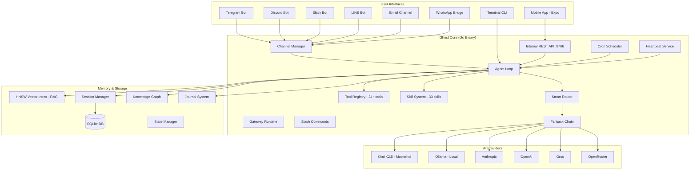

# Ghost — Full Project Review

> *"Your Sovereign Intelligence."*

## What Ghost Is

Ghost is a **self-hosted, sovereign AI assistant** written in Go, designed to run natively on a **Raspberry Pi 5** (or any Linux/Windows machine). It connects a lightweight local agent with cloud LLM reasoning (Kimi K2.5, Anthropic, OpenAI, etc.) and local inference via **Ollama**, creating a persistent, always-on AI presence you fully control.

---

## Architecture Overview



---

## Core Features

### 1. Multi-Channel Gateway
Ghost runs a unified gateway that connects to **7 messaging channels** simultaneously:

| Channel | Protocol | Status |
|---------|----------|--------|
| Telegram | Bot API (polling) | Primary |
| Discord | WebSocket (gateway) | Supported |
| Slack | Socket Mode | Supported |
| LINE | Webhook | Supported |
| Email | SMTP/IMAP | Supported |
| WhatsApp | WebSocket bridge | Supported |
| Mobile App | REST API + WebSocket | Primary |

Each channel has **allow-list filtering** (`allow_from`) for access control.

### 2. Agentic Tool System (30+ Built-in Tools)

| Category | Tools |
|----------|-------|
| **Filesystem** | `read_file`, `write_file`, `edit_file`, `append_file`, `list_dir` |
| **Shell** | `exec` (guarded, 6h cooldown), `sandbox` (safe code running) |
| **Web** | `web_search` (Brave/DuckDuckGo), `web_fetch`, `agent-browser` (interactive CDP automation) |
| **Memory** | `remember` (RAG vectorization), `oracle` (context bundling), `memory_curate` (bounded dual-store), `session_search` (FTS5 SQLite) |
| **Communication** | `message` (direct user reply), `canvas` (visual HTML output) |
| **Hardware** | `i2c`, `spi` (Linux GPIO), `networking` (Tailscale/Bonjour) |
| **Media** | `video_frames` |
| **Agent** | `spawn` (async subagent), `subagent` (sync), `lane` (isolated context), `compaction` |
| **Automation** | [cron](file:///d:/laragon/www/ghost/cmd/ghost/main.go#1088-1125) (schedule tasks), `voice_wake` (always-listening trigger) |
| **Infra** | [update](file:///d:/laragon/www/ghost/pkg/agent/loop.go#1065-1084) (self-update), MCP tools (dynamic external tools) |

All tool parameters are validated against **JSON Schema** to prevent LLM hallucinations.

### 3. Skill System (53+ Installed Skills)

Skills are modular capability packs in `workspace/skills/`, each containing a `SKILL.md` definition plus optional scripts:

Ghost features **Self-Improving Skills**: the LLM is granted the `skill_manage` tool, allowing it to autonomously author, edit, and patch its own behavioral skillpacks on the fly.

````carousel
| Skill | Purpose |
|-------|---------|
| `weather` | Weather forecasts |
| `aqi` | Air quality index |
| `crypto` | Cryptocurrency prices |
| `currency` | Currency conversion |
| `speedtest` | Network speed testing |
| `camera` | Pi camera capture |
| `spotify` | Music playback control |
| `homeassistant` | Smart home control |
| `calendar` | Google/Outlook calendars |
| `email` | Email send/receive |
| `journal` | Daily journaling |
| `git` / `github` | Version control |
<!-- slide -->
| Skill | Purpose |
|-------|---------|
| `research` | Deep research workflow |
| `summarize` | Text summarization |
| `scraper` | Web scraping |
| `recipe` | Recipe search/management |
| `shopping` | Shopping lists |
| `find-nearby` | Location-based search |
| `flight` | Flight tracking |
| `ascii-art` | ASCII art generation |
| `network` | Network diagnostics |
| `hardware` | Hardware monitoring |
| `healthcheck` | System health checks |
| `process-manager` | Process management |
| `productivity` | Productivity tools |
| `organizer` | File organization |
| `knowledge-base` | Knowledge management |
| `software-development` | Dev workflows |
| `skill-creator` | Create new skills |
| `mobile` | Mobile app bridge |
| `system` | System administration |
| `tmux` | Terminal multiplexing |
````

Skills can be installed from repositories via `ghost skills install <repo>`, listed, removed, and searched through the CLI.

### 4. Memory & RAG System

Ghost maintains **4 layers of memory**:

1. **Structured History** — All conversations in SQLite with **FTS5 full-text search** (`session_search` tool)
2. **RAG (Semantic Search)** — Important facts vectorized via embeddings, stored in an HNSW index ([chromem-go](https://github.com/philippgille/chromem-go)) for O(log n) similarity retrieval
3. **Bounded Curated Memory** — A dual-store (`user-profile.md` + `curated-memory.md`) mechanism managed autonomously by the `memory_curate` tool. Enforces token limits (5k chars per file) and injects strictly verified context directly into the system prompt.
4. **Reflective** — Periodic LLM-generated summaries (auto-triggered by session length)

The `remember` tool lets Ghost explicitly store facts, while the `oracle` tool bundles workspace context (GHOST.md, USER.md, state) into a single grounded prompt.

### 5. Knowledge Graph

A structured filesystem at `workspace/knowledge/` using a **Three-Space Architecture**:

- **`self/`** — Identity, current context, channel state, skill health
- **`notes/`** — MOCs, project notes, observations
- **`ops/`** — Inbox captures, task queue
- **`logs/`** — Session logs, error records

### 6. Heartbeat & Proactive Behavior

Ghost doesn't just wait for messages — it has autonomous routines:

| Schedule | Task |
|----------|------|
| **08:00** | Morning briefing: headlines, schedule, pending tasks |
| **22:00** | Evening reflection: summarize day, update knowledge |
| **Every 4h** | System health: CPU temp, disk, RAM alerts |
| **Weekly** | Skill audit, improvement recommendations |
| **Daily** | Skill dependency health check (`ghost doctor`) |

All heartbeat tasks have **guardrails**: max 120s per cycle, 45s per task, deferred during active chat, idempotent execution.

### 8. Hybrid Workflow System (20+ Bundled Workflows)

Ghost integrates a powerful ClawFlows-inspired workflow engine natively into the cron service. Workflows are scheduled, deterministic markdown skill files (`workspace/skills/workflows/*.md`) executed on natural language schedules (e.g. `schedule: "Sunday 6pm"`). 

**20 predefined personal productivity routines** are included covering:
- Daily briefings & evening prep
- Pre-meeting attendee research
- Subscription audits & bill tracking
- Package delivery consolidation
- Automated digital hygiene & cleanup

### 8. Smart Routing & Provider Fallback

- **Router**: Classifies message complexity to route between light models (local Ollama) and heavy models (cloud Kimi/Claude)
- **Fallback Chain**: If primary provider fails, automatically tries configured fallback models with cooldown periods
- **Multi-Provider**: Supports Kimi K2.5 (Moonshot), Anthropic Claude, OpenAI, Ollama (local), Groq, OpenRouter, Zhipu, and Gemini simultaneously

### 9. Subagent System

Ghost can **spawn child agents** for parallel task execution:
- `spawn` — Async background execution with callback
- `subagent` — Synchronous execution with result return
- Each subagent gets its own tool registry (recursion-safe)
- Results routed back via the message bus

### 10. Mobile App (Expo/React Native)

A companion mobile app (`ghost-app/`) providing:
- Chat interface with streaming responses
- Voice transcription (Kimi or Groq backends)
- Pi remote control
- Connection via local network or **Tailscale** mesh VPN
- Secured with `BRIDGE_SECRET` authentication

### 11. Terminal Dashboard (TUI)

Built with [Bubble Tea](https://github.com/charmbracelet/bubbletea) + [Lip Gloss](https://github.com/charmbracelet/lipgloss) — a rich terminal operator dashboard (`ghost dashboard`).

### 12. Diagnostics (`/doctor`)

Read-only health checks available via:
- Slash command: `/doctor`
- REST endpoint: `GET /v1/doctor`
- Checks: DB connectivity, provider availability, skill dependencies, tool registration

### 13. MCP (Model Context Protocol) Support

Ghost can dynamically load tools from external MCP servers configured in `config.json`, extending its capabilities without code changes.

---

## Project Objectives

Based on the codebase, documentation, and architecture:

1. **Digital Sovereignty** — Run your own AI on your own hardware. No cloud dependencies for core functionality. Your data stays on your device.

2. **Persistent Intelligence** — Not a stateless chatbot. Ghost remembers conversations, learns patterns, stores knowledge, and reflects on its own activity.

3. **Proactive Autonomy** — Ghost acts without being asked: morning briefings, health monitoring, knowledge grooming, scheduled automation.

4. **Edge-First Design** — Optimized for Raspberry Pi 5 with 8GB RAM. Lightweight Go binary (~34MB), SQLite storage, local inference via Ollama.

5. **Multi-Channel Presence** — One agent, many interfaces. Access Ghost from Telegram, Discord, Slack, mobile app, terminal, or email — all with unified context.

6. **Extensible Skill Platform** — Modular skills that can be installed, removed, and created. Community-driven skill registry with `ghost skills search`.

7. **Self-Modifying** — The full source code ships with the binary. Ghost includes an `update` tool and is designed for on-device hacking and iteration.

8. **Future: Ghost OS** — The roadmap envisions Ghost evolving into a **multi-agent, multi-tenant operating system** where specialized agents (Sales, Support, Research) run in isolated containers with dedicated memory, each serving different roles within an organization.

---

## Tech Stack Summary

| Layer | Technology |
|-------|-----------|
| **Language** | Go 1.25+ |
| **Database** | SQLite (modernc.org/sqlite — pure Go) |
| **Vector Search** | HNSW via chromem-go |
| **LLM Providers** | Kimi K2.5, Anthropic, OpenAI, Ollama, Groq, OpenRouter, Zhipu, Gemini |
| **Schema Validation** | santhosh-tekuri/jsonschema |
| **Messaging** | Telegram (telego), Discord (discordgo), Slack (slack-go), LINE, Email |
| **Terminal UI** | Bubble Tea + Lip Gloss |
| **Mobile** | Expo / React Native |
| **Build** | Make + GoReleaser |
| **Deployment** | systemd service, Docker, direct binary |
| **Networking** | Tailscale mesh VPN (optional) |

---

## Codebase Metrics

| Metric | Value |
|--------|-------|
| Go packages | 29 |
| Go source files | 143+ |
| Built-in tools | 30+ |
| Installed skills | 53+ |
| Messaging channels | 7 |
| LLM providers | 8+ |
| Binary size | ~34 MB |
| License | MIT |
